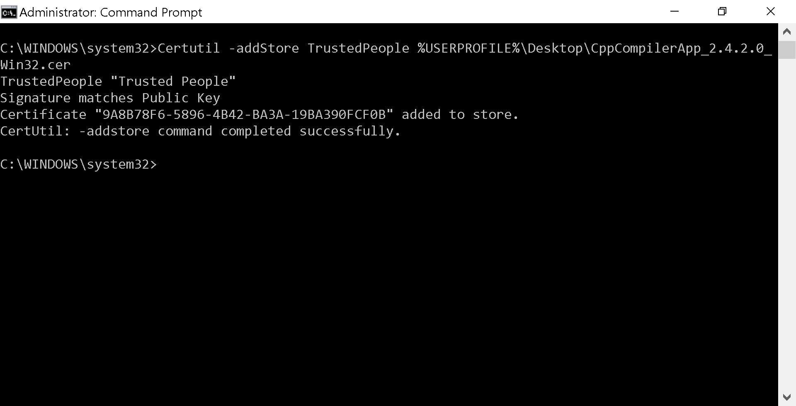
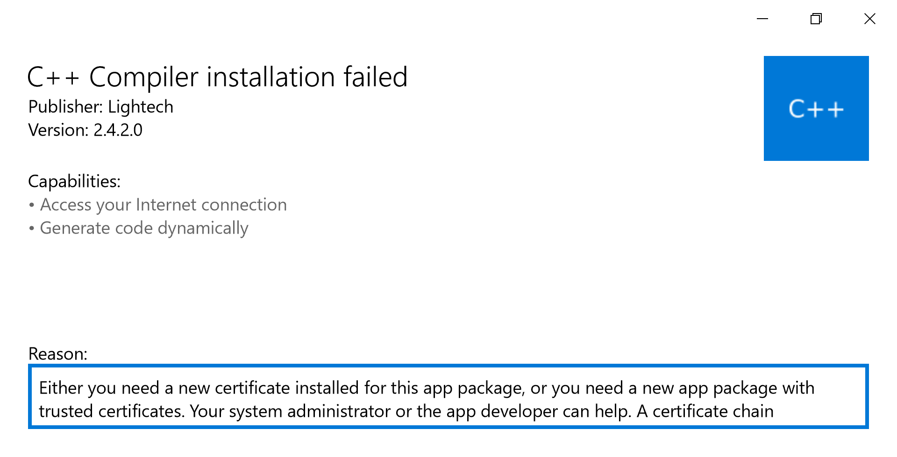

Universal Windows Platform (UWP) app to compile C/C++
=====================================================

For use with our [DevMax C/C++ IDE](https://www.microsoft.com/en-us/store/p/devmax/9mzqlt5d5b39).

This application uses code from LLVM, Clang and LLD. See  the included [LLVM License](LLVM_LICENSE.md) for the library licensing terms. Note that we only distribute the application binary.

Installation Instruction
------------------------

  * Download the app (`.appx` file) and the certificate (`.cer` file) from https://github.com/light-tech/UniversalCppCompiler/releases
  * Install the certificate: Open the Command Prompt  __Run as Administrator__ and run the command `Certutil -addStore TrustedPeople PATH_TO_CER_FILE`. For example, assume that the `.cer` for version `2.4.2.0` is downloaded to Desktop, issue the command `Certutil -addStore TrustedPeople %USERPROFILE%\Desktop\CppCompilerApp_2.4.2.0_Win32.cer`. Read https://msdn.microsoft.com/en-us/library/windows/desktop/jj835832(v=vs.85).aspx for more information. (In general, this step is only necessary when the certificate expires or you delete it in the certificate store.)
  
  * Enable either __Sideloads app__ or __Developer mode__ in __Settings > Update & Security > For developers__.
  
  * Double click on the `.appx` file to install the app. It is necessary to install the certificate before this. If you don't, the following will appear: *Either you need a new certificate installed for this app package, or you need a new app package with trusted certificates. Your system administrator or the app developer can help. A certificate chain processed, but terminated in a root certificate which isn't trusted (0x800B0109)*
  

Note that to use the C/C++ Interpreter, you do not need to get all Microsft's C/C++ headers and libraries. If necessary, you can get the ISO C/C++ headers.
